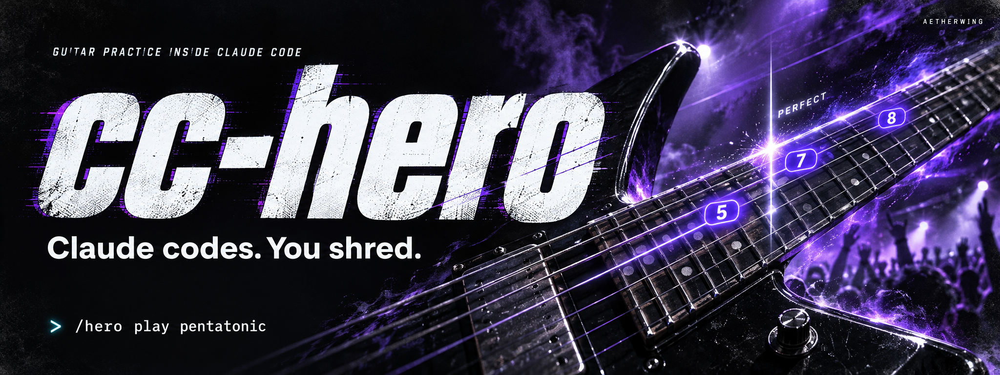
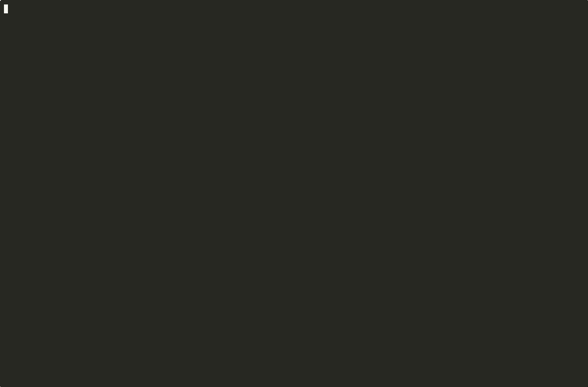

<p align="center">
  
</p>

# cc-hero

**Claude codes. You shred.**

Guitar practice in a Claude Code pane. `/hero` scrolls a song past a now-marker
as tablature and standard notation, Guitar Hero style, and scores what you play.
With the microphone listener on it hears the guitar, judges each note's pitch and
timing, and doubles as a tuner. Without it, the space bar strums for timing practice.

[Get playing](#get-playing) · [See the pane](#what-you-see) · [Exercises](#exercises) · [Coach & progress](#progress-and-the-coach) · [Settings](#settings)

- **Chase a perfect run.** Scrolling tabs and notation, pitch and timing scores, and combos.
- **Bring your guitar.** Play through a microphone or USB interface, with a tuner built in.
- **Find your next riff.** Built-in songs, Ultimate Guitar search, and your own song files.
- **Practice with a purpose.** Scales, chord changes, fingerpicking, and coaching based on your runs.

## Get playing

### You need

- **Claude Code 2.1.280 or newer**, with function hooks turned on (they are early
  access): `CLAUDE_CODE_ENABLE_FUNCTION_HOOKS=1` in the environment of the `claude`
  you start. Put `export CLAUDE_CODE_ENABLE_FUNCTION_HOOKS=1` in your shell profile
  to stop typing it.
- **ffmpeg** and **bun** (or node 22+) for the microphone listener:
  `brew install ffmpeg` and `brew install oven-sh/bun/bun` on a Mac. Without them
  everything but the mic and the tuner still works; the space bar strums.
- A terminal at least 40 columns wide; 110 or more docks the pane beside the transcript.

### Install

As a plugin, so it loads in every session:

```sh
claude plugin marketplace add aetherwing-io/cc-hero
claude plugin install cc-hero@cc-hero
```

or straight from a checkout, which also picks up your edits as you make them:

```sh
git clone https://github.com/aetherwing-io/cc-hero.git
CLAUDE_CODE_ENABLE_FUNCTION_HOOKS=1 claude --plugin-dir ./cc-hero
```

### Check it loaded

Inside the session, `/hero` prints the command list and `/hero list` the built-in
songs. If `/hero` is not a command, the flag was not set for that `claude`
(`echo $CLAUDE_CODE_ENABLE_FUNCTION_HOOKS` should print `1`), or the plugin is
not enabled (`claude plugin list`). Update with `claude plugin marketplace update cc-hero`.

### Play

Start `claude` (with the flag), then, inside the session:

```
/hero play pentatonic # A minor pentatonic, box 1: /hero list shows all built-ins
/hero play my.json    # your own (see songs/README.md)
/hero search wonderwall           # look a song up on Ultimate Guitar: the pane lists the results
/hero play #2                     # or open one by number: chords play as a chord sheet, tabs as notes
/hero play https://tabs.ultimate-guitar.com/tab/...   # or paste a page's URL
/hero tune            # the tuner
/hero mic on          # start listening (ffmpeg; macOS asks once for microphone access)
/hero latency 80      # if hits read late: how many ms behind the listener hears you
/hero stop
```

Use fullscreen rendering (`/tui fullscreen` once, or `CLAUDE_CODE_NO_FLICKER=1`):
it captures the mouse so you can click the pane, and in a terminal 110 columns
or wider it docks the pane beside the transcript, floor to ceiling. Inside tmux,
add `set -g mouse on` to `~/.tmux.conf` for the mouse to reach the pane.

After a search, click the pane and pick a result with **↑**/**↓** (or j/k), **enter**
to open it, a digit to jump, **t** to go back to the song.

Click the pane to give it the keyboard, then: **enter** starts (with a one-bar
count-in), **space** strums, **p** pauses, **r** restarts, **+**/**-** change the
tempo, **m** toggles the microphone, **t** toggles the tuner, **?** shows the keys,
**esc** hands the keys back to the prompt.

## What you see

<p align="center">
  
</p>

Above: Ode to Joy played from a recording fed to the listener, docked beside the
transcript in fullscreen mode.

A tab excerpt from the built-in A minor pentatonic run. The pane also draws
standard notation underneath.

```
♪ A minor pentatonic, box 1 · 110 bpm · 900 pts · combo 9 · 100%
e|────────────│───────5═══8═══8═══5═══────────┊───────────────┊─
B|────────────5═══8═══────────┊───────8═══5═══┊───────────────┊─
G|────5═══7═══│───────────────┊───────────────7═══5═══────────┊─
D|7═══────────│───────────────┊───────────────┊───────7═══5═══┊─
A|────────────│───────────────┊───────────────┊───────────────7═
E|────────────│───────────────┊───────────────┊───────────────┊─
  ·   ·   ·   3   ·   ·   ·   4   ·   ·   ·   5   ·   ·   ·   6
PERFECT (+12ms) · mic ● E4 +4¢
```

Upcoming notes wear their string's color (high e magenta down to low E blue).
A hit turns the note green (bright with a starburst for a perfect), a loose hit
yellow, a wrong pitch magenta, a miss red, and the now-marker flashes in the
same color. A long note you keep sounding glows as its tail crosses the marker
and earns hold points on top of the hit. Ten hits in a row light a ×2
multiplier banner (×3 at twenty, ×4 at thirty); a miss after a streak says so.
The magenta diamond on the staff is the pitch the microphone hears right now.

## Exercises

```
/hero progression G pop            # I V vi IV in G, strummed D DU UDU (pop, axis, doowop, blues, jazz, folk, andalusian, canon)
/hero progression Am i bVII bVI V  # roman numerals or chord names, in any key
/hero pick travis G pop            # fingerpicking over a progression: travis, arp, folk, waltz, pinch
/hero scale pentatonic A 1         # a scale box, up and back: major, minor, pentatonic, majorpentatonic, blues, dorian, mixolydian
/hero caged C                      # the five CAGED forms of a chord up the neck
/hero drill                        # something at random
/hero strum "D DU UDU"             # a strumming pattern for the loaded chord sheet (D, U, X muted, - rest, one token a beat)
```

Options ride along: `--bpm 60`, `--x 3` (repeats), `--beats 2` (beats a chord).
Fingerpicking shows the picking finger (p i m a) above each note and the chord
it belongs to on the ruler. A chord sheet with a strumming pattern shows arrows
under the chord lane, one target a strum; Ultimate Guitar chords pages bring
their own pattern.

## Progress and the coach

```
/hero stats                        # recent runs and the weak spots of the current song
/hero coach                        # Claude reads your run data and says what to work on
/hero lesson chord changes in G    # Claude plans 3-6 drills with accuracy goals
/hero next                         # run the current step; the goal is checked when the run ends
```

Every finished run is recorded in the plugin store: score, accuracy, timing
offsets, and which chords or notes were missed. The coach and the lesson planner
get that data as text through the session's own model access, nothing else.

## Settings

```
/hero config                       # every setting with its value
/hero config latency 60            # set one; /hero config reset puts the defaults back
```

| key       | what                                                              | default   |
| --------- | ----------------------------------------------------------------- | --------- |
| `device`  | the audio input the listener opens (`/hero mic devices` lists them) | `0`       |
| `latency` | how late the listener hears you, in ms, subtracted from every note | `0`       |
| `beats`   | beats a chord lasts on an imported chord sheet                    | `4`       |
| `steps`   | tab columns per beat on an imported tab page                      | `4`       |
| `bpm`     | tempo for an imported page that names none                        | `90`      |
| `strum`   | the strumming pattern a progression exercise starts with          | `D DU UDU` |
| `coach`   | the model the coach and the lesson planner use                    | `sonnet`  |
| `rows`    | rows the pane asks for when it opens above the prompt             | `28`      |

Settings live in Claude Code's plugin configuration, so they persist across
sessions and also show up under the plugin in `/config` and in
`/plugin configure cc-hero@cc-hero` (the install's "options not yet set" note
means the defaults apply); `/hero latency`, `/hero import` and
`/hero mic device` write the same rows.

## Chord sheets

A chords page (or a JSON file with `"kind": "chords"`) opens in chord mode: the
chord names scroll along a lane past the now-marker, the current and the next
shape are drawn as diagrams, and the words of the current line light up as they
are sung, the next line dim below. Each chord lasts one bar unless the file says
otherwise (`/hero import beats 2` halves that for the next import). The tempo
comes from the page's strumming pattern when it has one, else 90 bpm; `+`/`-`
change it while you play.

Strums are judged by chroma: the listener measures how much energy each pitch
class carries and compares it with the chord's template, so an Am strum counts
for Am and not for C, even though they share two notes. Without the microphone,
space strums.

Ultimate Guitar pages are fetched as your browser would and cached in the plugin
store. They are for your own practice; the site's terms apply to what you do with
them.

## The listener

`listen/listen.ts` is a small process the mod starts through `$.process.spawn`
(bun, or node 22+). It captures audio with `ffmpeg` (avfoundation on macOS, pulse
on Linux, dshow on Windows), runs YIN pitch detection on 93 ms windows every 23 ms,
and streams one JSON line per frame with what it hears and the recent note onsets.
Nothing leaves the machine.

- `brew install ffmpeg` if you do not have it.
- macOS asks once for microphone access for the terminal app you run Claude in.
- A different input: `/hero mic devices` lists them and `/hero mic device <n or name>`
  picks one. A guitar with a USB audio output (the Donner HUSH-I PRO, for one) or
  any USB guitar interface shows up there and gives a far cleaner signal than a
  microphone. A guitar with only a 1/4" jack (the plain HUSH-I) needs a small
  interface between it and the Mac.

Test it without a guitar:

```sh
ffmpeg -f lavfi -i "sine=frequency=110:duration=2" -ar 22050 /tmp/a.wav
bun listen/listen.ts --out - --input /tmp/a.wav | head -3
```

or play a recording through the whole thing: `/hero mic file take.wav 3.5` feeds
the file as if it were the microphone and starts the song so that beat 0 lands
3.5 seconds into it (with the one-bar count-in shown first). Without the number,
you start the song yourself with enter.

## Development

```sh
git clone https://github.com/aetherwing-io/cc-hero.git && cd cc-hero
claude -p '/plugin-types'                     # writes .claude/types/ (the API contract; gitignored)
bunx tsc -p tsconfig.json                     # typecheck hooks and tests
CLAUDE_CODE_ENABLE_FUNCTION_HOOKS=1 claude plugin test .
claude plugin validate .
CLAUDE_CODE_ENABLE_FUNCTION_HOOKS=1 claude --plugin-dir .   # run it; a save of a hooks file reloads the plugin
```

To try the marketplace install from a checkout instead of GitHub:
`claude plugin marketplace add /path/to/cc-hero` then `claude plugin install cc-hero@cc-hero`.

Layout: `hooks/register.tsx` is the hooks module (the `/hero` command, the pane,
the listener's lifecycle, best scores in `$.store`); `hooks/board/hero.tsx` is
the surface module that draws and judges on the drawing thread; `hooks/music/`
holds the pure logic (pitches, staff positions, songs, scoring); `listen/` is the
microphone helper.

The function-hooks API is early access and may change between Claude Code releases.
